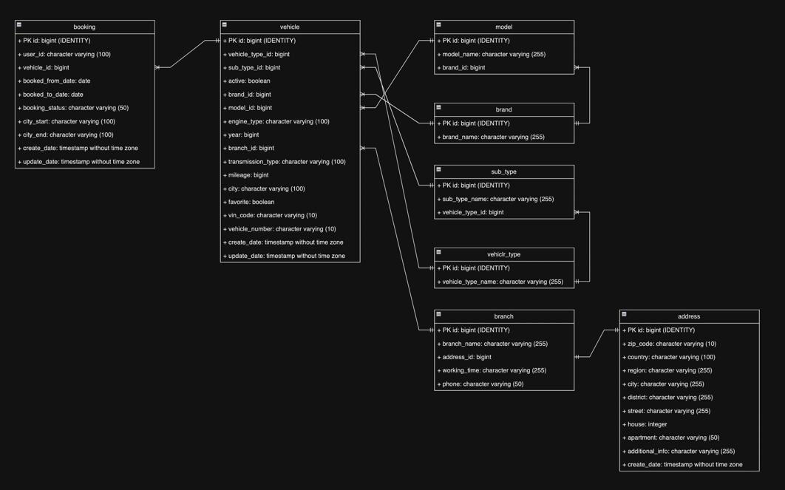
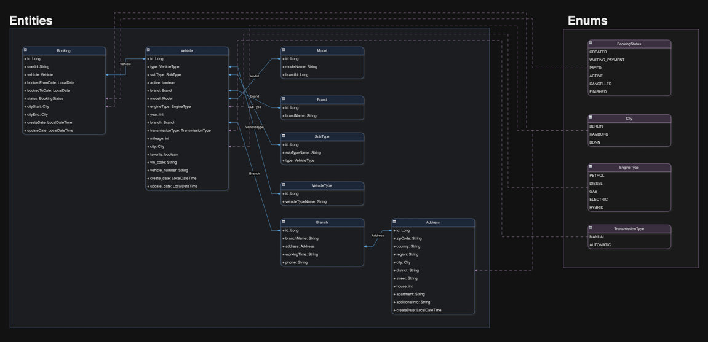
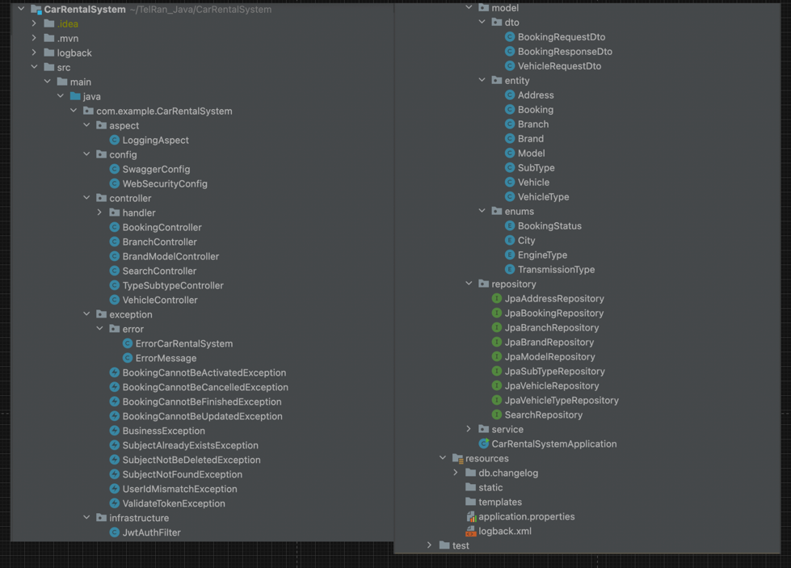

# Car Rental System [Backend]

The prototype data of the server part of the main services of the vehicle rental system includes the following elements: vehicles, reservations, vehicle locations, vehicle types, brands and models.

**Database Diagram**

**Diagram CarRentalSystemApplication**

**Schema of project**

**Swagger**
- if the project was launched locally - http://localhost:11000/swagger-ui/index.html#
- if project was launched in docker - http://localhost:8081/swagger-ui/index.html#

**Used technology stack in my web application:**
- Java 17
- Spring Framework
- Spring Security
- JPA
- PostgreSql
- H2
- Liquibase
- Jupiter - Testing
- Mockito - Testing
- Maven
- SLF4J
- Logback
- JaCoCo

### Database Structure

**Table address (class Address)**

| Column name | Type                   | Description                                                  |
| ------------ |------------------------|--------------------------------------------------------------|
| id  | bigint                 | id key of entity - NOT NULL GENERATED BY DEFAULT AS IDENTITY |
| zip_code  | character varying(10)  | zip code of address                                          |
| country  | character varying(100) | country name - NOT NULL                                      |
| region  | character varying(255) | region name                                                  |
| city  | character varying(255) | city name - NOT NULL                                         |
| district  | character varying(255) | district name                                                |
| street  | character varying(255) | street name - NOT NULL                                       |
| house  | integer                | house number                                                 |
| apartment  | character varying(50)  | apartment number of name - NOT NULL                          |
| additional_info  | character varying(255) | additional infornation to the address                        |
| create_date  | timestamp without time zone | timestamp of row creation - NOT NULL                         |

**Table booking (class booking)**

| Column name | Type                   | Description                                                  |
| ------------ |------------------------|--------------------------------------------------------------|
| id  | bigint                 | id key of entity - NOT NULL GENERATED BY DEFAULT AS IDENTITY |
| user_id  | character varying(100) | userId (from JWT), who created this booking -  NOT NULL      |
| booked_from_date  | date                   | first date if booking - NOT NULL                             |
| booked_to_date  | date                   | last date if booking - NOT NULL                              |
| booking_status  | character varying(50)  | booking status - NOT NULL                                    |
| city_start  | character varying(100) | city, when user will take a vehicle - NOT NULL               |
| city_end  | character varying(100) | city, when user will return a vehicle - NOT NULL             |
| create_date  | timestamp without time zone | timestamp of row creation - NOT NULL                         |
| update_date  | timestamp without time zone | timestamp of last update                                     |

**Table branch (class Branch)**

| Column name | Type                        | Description                                                 |
| ------------ |-----------------------------|-------------------------------------------------------------|
| id  | bigint                      | id key of entity - NOT NULL GENERATED BY DEFAULT AS IDENTITY |
| branch_name  | character varying(255)      | branch name - NOT NULL                                      |
| address_id  | bigint                      | address of this branch - NOT NULL                           |
| working_time  | character varying(255)      | working time of this branch - NOT NULL                      |
| phone  | character varying(50)       | contact phone for this branch - NOT NULL                    |

**Table brand (class Brand)**

| Column name | Type                        | Description                                                  |
| ------------ |-----------------------------|--------------------------------------------------------------|
| id  | bigint                      | id key of entity - NOT NULL GENERATED BY DEFAULT AS IDENTITY |
| brand_name  | character varying(255)      | brand name - NOT NULL                                                  |

**Table model (class Model)**

| Column name | Type                   | Description                                                  |
| ------------ |------------------------|--------------------------------------------------------------|
| id  | bigint                 | id key of entity - NOT NULL GENERATED BY DEFAULT AS IDENTITY |
| model_name  | character varying(255) | model name - NOT NULL                                                 |
| brand_id  | bigint                   | brand of this model - NOT NULL                                         |

**Table vehicle_type (class VehicleType)**

| Column name | Type                        | Description                                                  |
| ------------ |-----------------------------|--------------------------------------------------------------|
| id  | bigint                      | id key of entity - NOT NULL GENERATED BY DEFAULT AS IDENTITY |
| vehicle_type_name  | character varying(255)      | type name - NOT NULL                                                   |

**Table sub_type (class SubType)**

| Column name | Type                   | Description                                                  |
| ------------ |------------------------|--------------------------------------------------------------|
| id  | bigint                 | id key of entity - NOT NULL GENERATED BY DEFAULT AS IDENTITY |
| sub_type_name  | character varying(255) | subtype name name - NOT NULL                                           |
| vehicle_type_id  | bigint                   | vehicle type of this subtype - NOT NULL                                |

**Table vehicle (class Vehicle)**

| Column name | Type                   | Description                                                  |
| ------------ |------------------------|--------------------------------------------------------------|
| id  | bigint                 | id key of entity - NOT NULL GENERATED BY DEFAULT AS IDENTITY |
| vehicle_type_id  | character varying(255) | type of thos vehicle - NOT NULL                                       |
| sub_type_id  | bigint                 | subtype type of this vehicle - NOT NULL                                |
| active  | boolean                | conditiion of this vehicle                                   |
| brand_id  | bigint                 | brand of this vehicle - NOT NULL                                       |
| model_id  | bigint                 | model of this vehicle - NOT NULL                                       |
| engine_type  | character varying(100) | engine type of this vehicle - NOT NULL                                 |
| year  | bigint                 | year of manufacture of this vehicle                          |
| branch_id  | bigint                 | branch of this vehicle - NOT NULL                                      |
| transmission_type  | character varying(100) | transmission type of this vehicle - NOT NULL                           |
| mileage  | bigint                 | actual mileage of this vehicle                               |
| city  | character varying(100) | actual city where is staing this vehilce - NOT NULL                    |
| favorite  | boolean                | a note about adding a vehicle to the preferred list          |
| vin_code  | character varying(10)                | vincode of this vehicle - NOT NULL                                     |
| vehicle_number  | character varying(10)                |  registration number of this vehicle - NOT NULL                 |
| vehicle_number  | character varying(10)                |  registration number of this vehicle                  |
| create_date  | timestamp without time zone | timestamp of row creation - NOT NULL                       |
| update_date  | timestamp without time zone | timestamp of last update                                     |

